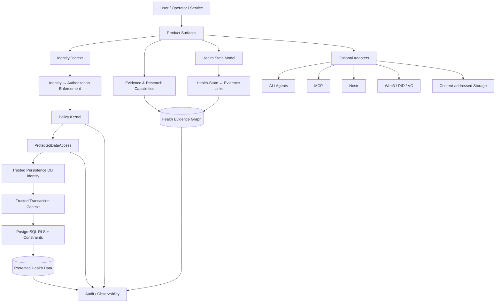
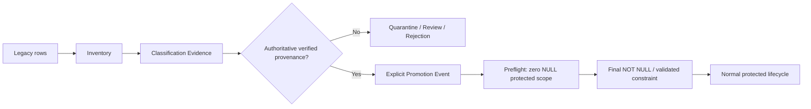

# SOMA-OS System Architecture + Product Specification v1

**Status:** Proposed baseline for review  
**Branch:** `docs/soma-system-product-spec-v1`  
**Scope:** architecture and product contract for the current SOMA security/data foundation and the next legacy-data migration gate.

## 1. Purpose

SOMA-OS is an evidence-aware health intelligence infrastructure. This specification freezes the current architectural direction before further implementation of verified legacy-data promotion and the final protected-row constraint gate.

This document is a design baseline, not a claim that every component below is already production-ready.

## 2. Product principles

1. **Shared-first:** reusable capability belongs in shared infrastructure.
2. **One canonical domain:** contracts and domain invariants are canonical even when implementations are polyglot.
3. **Rust as canonical/reference runtime:** security-sensitive and domain-critical behavior is implemented or specified against the Rust reference runtime.
4. **Policy before execution:** no protected operation reaches storage without identity, authorization, and target-scope validation.
5. **Evidence integrity:** provenance, uncertainty, source status, and transformation lineage survive downstream processing.
6. **Fail closed:** ambiguous security state denies access rather than guessing.
7. **Independent surfaces:** a transport, provider, model, agent, or optional protocol cannot redefine core policy.
8. **Optional capabilities remain optional:** AI, Nostr, Web3, DID/VC, and content-addressed storage are adapters, not core dependencies.
9. **Archive before deletion:** historical material is preserved until removal is evidenced.
10. **No silent legacy promotion:** legacy data becomes protected only through explicit, verified, auditable promotion.

## 3. System context



### Authority boundaries

| Layer | Authority | Responsibility | Must not do |
|---|---|---|---|
| Product surfaces | none | UX, transport, request collection | redefine policy or infer security scope |
| IdentityContext | identity/scope assertion | represent verified principal and explicit scopes | contain credentials/tokens or delegation |
| Authorization Enforcement | security boundary | validate identity + target + exact PolicyRequest | invent grants |
| Policy Kernel | authorization authority | deterministic allow/deny/degrade/review semantics | read/write protected data directly |
| ProtectedDataAccess | persistence gate | bind authorized operation to target and adapter | grant access independently |
| Trusted DB identity/context | storage trust boundary | establish DB execution identity and transaction-local scope | accept untrusted caller claims |
| PostgreSQL RLS/constraints | defense-in-depth | contain storage-layer mistakes and cross-scope access | replace application authorization |
| Evidence Graph | evidence authority | represent source/claim/evidence/safety/applicability | silently convert evidence into diagnosis |
| Optional adapters | integration boundary | connect external protocols/providers | become required for core operation |

## 4. Canonical execution path

```text
Request
  ↓
Verified IdentityContext
  ↓
Identity → Authorization Enforcement
  ↓
Policy Kernel decision
  ↓
ProtectedDataAccess target binding
  ↓
Trusted persistence service identity
  ↓
Transaction-local trusted tenant/data-domain context
  ↓
PostgreSQL RLS + constraints
  ↓
Protected data operation
  ↓
Audit / evidence-preserving result
```

Any missing, malformed, expired, revoked, conflicting, or caller-supplied security field fails closed.

## 5. Health information architecture

SOMA distinguishes personal state from general evidence.


### Health State Model

Canonical entity types are:

- person
- observation
- interpretation
- goal
- context
- intervention
- response
- outcome

Observations and interpretations carry uncertainty. Provenance is mandatory.

### Evidence Graph

The graph represents claims, sources, studies, populations, interventions, outcomes, evidence assessment, safety assessment, and applicability. Evidence status is lifecycle-based rather than binary.

The system must not collapse “source found”, “evidence assessed”, “safe”, and “applicable” into one trust flag.

## 6. Legacy data lifecycle

The next implementation gate is deliberately staged:



### Promotion invariants

- A legacy row cannot become protected because it has a plausible tenant, domain, hash, transport, model, agent, or caller assertion.
- Only `SCOPED_VERIFIED` classification with `VERIFIED` verification, both scope dimensions, and provenance can qualify.
- Authoritative verification must be provenance-bound to the classification.
- Conflicting or ambiguous classifications cannot promote.
- Promotion is explicit and auditable.
- Promotion is idempotent and rollback-safe.
- The final constraint gate is blocked while any protected row remains NULL-scoped.
- Classification history remains append-only/recoverable.

## 7. Product roles

### End user

Can view and manage their authorized health information and evidence-derived outputs within explicit scope and consent boundaries.

### Research/knowledge operator

Can work with evidence and research artifacts according to capability-specific authorization without receiving implicit access to personal protected data.

### Security/data operator

Can execute migration/classification/promotion workflows only through separately authorized operational capabilities. Migration authority is not equivalent to normal application access.

### System service

Executes approved shared capabilities under explicit service identity and capability policy.

## 8. Product capability map

| Capability family | Status | Product rule |
|---|---|---|
| Identity + authorization | foundational | canonical shared infrastructure |
| Protected health data | foundational | explicit tenant/data-domain isolation |
| Evidence graph | foundational | provenance + uncertainty preserved |
| Legacy classification | foundational migration capability | classification does not equal promotion |
| Verified promotion | next implementation gate | explicit provenance-bound promotion only |
| AI | optional | user-controlled; no independent authorization |
| Agents | optional/infrastructure | capability-scoped and auditable |
| MCP | optional/infrastructure | tool discovery/invocation must remain authorized |
| Nostr/Web3/DID/VC/IPFS | future adapters | plug-and-play; never core dependencies |

## 9. Product acceptance boundary for the next phase

Issue #50 is considered complete only when the implementation demonstrates:

1. deterministic classification eligibility;
2. explicit provenance-bound promotion;
3. conflict and ambiguity denial;
4. no scope inference from untrusted metadata;
5. idempotent promotion behavior;
6. transactional rollback safety;
7. a preflight proving zero NULL-scoped protected rows;
8. final constraint/NOT NULL enforcement only after successful preflight;
9. realistic legacy-state PostgreSQL verification;
10. full CI, evidence pipeline, protected-data bypass audit, and PostgreSQL adversarial tests;
11. documentation and product-readiness tracker reconciliation.

## 10. Non-goals of v1

- authentication provider implementation;
- session/token lifecycle;
- clinical diagnosis or treatment automation;
- replacing Policy Kernel authorization with database policy;
- automatic legacy inference;
- making AI mandatory;
- making decentralized protocols mandatory;
- broad UI implementation beyond the migration/security workflow specification.

## 11. Architectural decision

**Decision:** freeze the architecture above as the current SOMA-OS design baseline. Proceed with implementation only through explicit contracts and gates. Do not redesign the Policy Kernel, IdentityContext, or protected-data trust chain while implementing Issue #50 unless new evidence demonstrates a security defect.

This document is a design baseline and must not be interpreted as proof of production readiness. The repository master checklist remains the authoritative readiness tracker.
